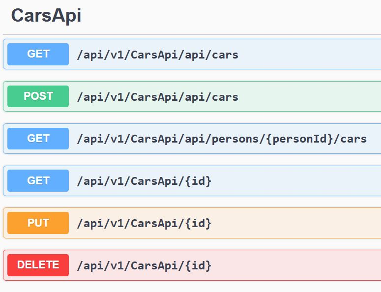
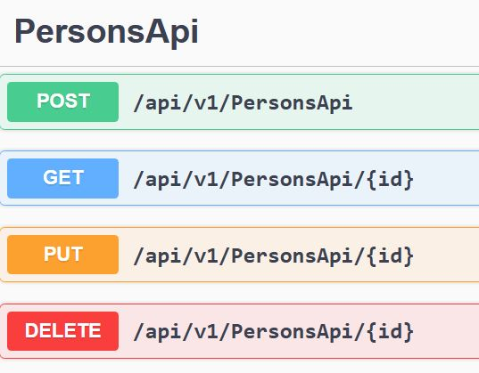
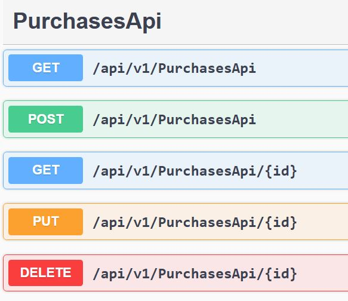

# CarAPI

- This is an ASP.NET Core web application using Entity Framework Core 
- It uses an **in-memory database**. No external setup required—just clone and run!
- It implements a 0 to many realtionship and a 1 to 1 relationship
- It supports CRUD operations
- The app can create Persons and Cars, then 
- a Person can buy a car

## Getting Started

### 1. Clone the repository
```bash
git clone https://github.com/teocot/CarAPI.git
```
- Open the app in Visual Studio
- You can also clone it directly in Visual Studio: "File->Clone repository" and enter 
- https://github.com/teocot/CarAPI.git

### 2. Run the app
- After cloning the app, you can start the app in Visual Studio
- No additional setup is required


## Prerequisites

- [.NET 8 SDK](https://dotnet.microsoft.com/en-us/download/dotnet/8.0)
- Git installed

## Demonstrate Entity framework

### Uses in memory database
- no need to run sql server or docker for a sql container

### Design
- zero to many relationsip person - puchases
- one to one relationship purchase - car
- Normally 1-1 is a same entity relation, this is the exception
- CRUD is also implemented
- we implemented REST APIs along with MVC 
- we use separate controllers for MVC and for REST

### 1. See the api swagger
- the app should be running
http://localhost:5183/swagger/index.html

### 2. Swagger views

- This is the interactive API documentation generated by Swagger. 
- You can test endpoints directly from the browser, while the app is running
- The endpoints are MVC endpoints.
- Here we present the Swagger for the REST endpoints











