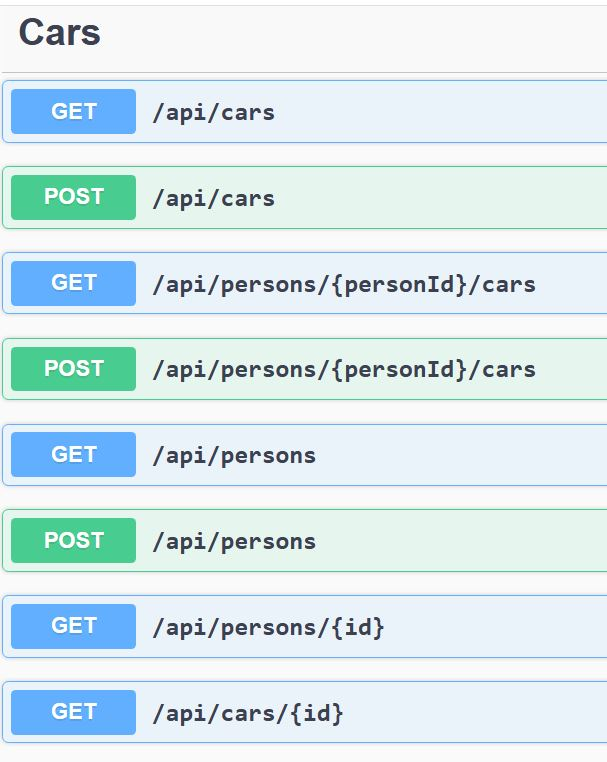

# CarAPI

- This is a simple ASP.NET Core web application using Entity Framework Core with an **in-memory database**. No external setup required—just clone and run!

## Getting Started

### 1. Clone the repository

```bash
git clone https://github.com/teocot/CarAPI.git
cd CarAPI
```
### 2. Restore the packages for the project
```bash
dotnet restore
```
### 3. Run the app
- open the solution in Visual studio and run the app


## Prerequisites

- [.NET 8 SDK](https://dotnet.microsoft.com/en-us/download/dotnet/8.0)
- Git installed

## Demonstrate Entity framework

### Uses in memory database
- no need to run sql server of docker for a container

### Design
- one to many relationsip person 0 has * puchases
- one to one relationship purchase one car
- Normally 1-1 is a same entity relation.
- A person can have 0..* cars
- CRUD is also implemented

### 1. See the api swagger
http://localhost:5183/swagger/index.html
work in progress, to use PUT and DELETE

### 2. Swagger view

This is the interactive API documentation generated by Swagger. You can test endpoints directly from the browser.




